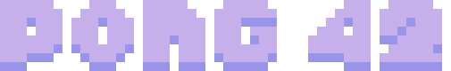
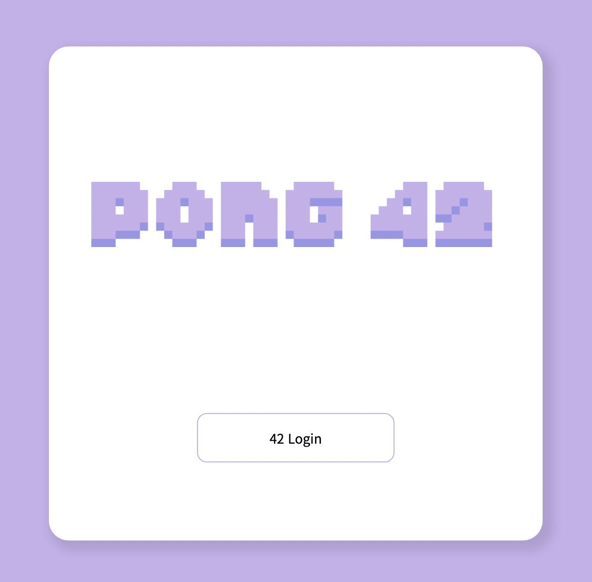

<a id="readme-top"></a>

<!-- PROJECT LOGO -->
<br />
<div align="center">
  <a href="https://github.com/42-Tomodachi/ft_transcendence">
    
  </a>

  <h3 align="center">Multiplayer Pong & Chat Web Site</h3>

  <p align="center">
    A final Project in 42
    <br />
    <br />
    
    
    
    <br />
    
    
    
    <br />
    
    

  </p>
</div>
<br />

<!-- TABLE OF CONTENTS -->
<details>
  <summary>Table of Contents</summary>
  <ol>
    <li>
      <a href="#about-the-project">About The Project</a>
      <ul>
        <li><a href="#signup">Signup</a></li>
        <li><a href="#lobby">Lobby</a></li>
        <li><a href="#in-chat">In Chat</a></li>
        <li><a href="#in-game">In Game</a></li>
      </ul>
    </li>
    <li>
      <a href="#getting-started">Getting Started</a>
      <ul>
        <li><a href="#prerequisites">Prerequisites</a></li>
        <li><a href="#installation">Installation</a></li>
      </ul>
    </li>
    <li><a href="#constraint">Constraint</a>
        <ul>
            <li><a href="#frontend">Frontend</a></li>
            <li><a href="#backend">Backend</a></li>
        </ul>
    </li>
    <li><a href="#member">Member</a></li>
    <li><a href="#license">License</a></li>
  </ol>
</details>

<!-- ABOUT THE PROJECT -->
<br />

## About The Project

---

<!-- 간단한 프로젝트 설명 -->
<!-- 구현 및 기술 스택 선정 이유 -->
<div align="center">
  
</div>

pong 42는 Typescript 기반의 React, Nest를 사용해서 만든 채팅 / 핑퐁 사이트이다.

페이지 구성으로는 회원가입, 메인 로비, 채팅방(일반, DM), 게임방이며 유저의 현재 상태, 채팅, 게임등 특정 요소를 실시간으로 반영했다.

<br/>

### Signup

#### 최초 회원가입 단계

<a href="https://youtu.be/YkjRyQb0Kxc">
  
</a>

> - 최초 회원가입시 42API를 통해 42cadet인지 확인
> - 프로필 작성에서 닉네임만 필수 입력으로 받음. 따로 프로필 등록을 하지 않으면 기본 프로필이 등록
> - 회원 등록이 완료시 기존 전체 유저목록을 보는 모든 유저들의 목록이 새로운 유저가 추가됨.

#### (2차인증 활성화시) 2차인증

<a href="https://youtu.be/5YgCceofzrs">
    
</a>

> - 42 intra에 등록된 이메일이 아니어도 2차 인증 정보를 받을 이메일이면 무관
> - 매번 로그인할 때마다 인증코드를 기입해야하며 로비에 있는 `내 프로필`의 2차 인증 비활성화를 눌러서 해제할 수 있음

### Lobby

#### 게임 / 채팅 로비

<a href="https://youtu.be/Enz_ptGrn5I">
    
</a>

> - 기본 로비는 게임방 목록이 보이는 게임 로비로 `42 PONG`로고를 입력하면 기본 로비로 이동한다
> - 게임 / 채팅 로비 둘다 디자인 골격은 동일(방 목록, 유저 목록, 내 프로필)하나 게임은 `래더 게임 입장`, 채팅은 `참여중인 채팅방`라는 고유 기능이 존재

#### 내 프로필 변경

<a href="https://youtu.be/OfwC8gAAh_A">
    
</a>

> - 게임 페이지빼고는 모든 페이지에서 로그인한 유저의 프로필 변경이 가능
> - `내 프로필 수정` 창에서 확인 버튼을 누르지 않는 이상 닉네임, 프로필 사진이 갱신되진 않는다.
> - 또한, 둘 중 하나라도 변경 사항이 있으면 프로필 갱신이 된다.

#### 유저 상태 실시간 반영(로그인, 로그아웃, 게임중)

<a href="https://youtu.be/7B3Tcogg0bQ">
    
</a>

> - 친구 관계는 팔로잉(Following) 관계로 한쪽에서 친구 추가시 해당 유저의 친구목록에만 해당 유저가 확인된다.
> - 유저가 로그인, 로그아웃, 게임중의 상태를 유저 목록에서 실시간으로 확인 가능

#### 게임 초대하기 / 초대받기 / 거절하기

<a href="https://youtu.be/koJMfGcMJJw">
    
</a>

> - 게임 초대는 어느 페이지든 유저 목록에서 특정 유저의 프로필 창을 볼 수 있다면 대전 신청이 가능하다. (단, 로그인 상태인 유저에게만 가능)
> - 승인과 동시에 게임 화면으로 이동하고, 카운트가 시작된다.

### In Chat

#### 기본 채팅 기능

<a href="https://youtu.be/wqPQWakBmZ8">
    
</a>

> - 채팅방 입장, 퇴장, 강퇴 등 전체 유저가 알아야할 내용은 브로드캐스팅 방식으로 채팅창 안에 공지 메세지로 표기된다.
> - 채팅방에 입장한 이후의 채팅만 볼 수 있다.
> - 채팅 내역은 DB에 저장된다.
> - 차단한 유저의 경우 차단한 시점 이후의 채팅은 보이지 않는다. 차단을 해제하면 이전의 모든 메세지를 볼 수 있다.

#### 채팅방 내 권한에 따른 기능

<a href="https://youtu.be/OUAKufhUSrs">
    
</a>

> - 채팅방 내 권한은 방 주인, 관리자, 일반으로 나뉘며 각 권한에 따라 유저 프로필을 볼 때 보여지는 프로필 구성이 다르다.
> - 방 관리자라 해도 방 주인을 강퇴, 음소거할 수는 없다.
> - 강퇴, 음소거시 10초간 해당 유저는 재입장, 채팅 입력이 금지된다.
> - 방 주인이 방을 나갈 경우 해당 채팅방은 삭제된다.

#### 방 설정 변경

<a href="https://youtu.be/64Nd8Vj19ns">
    
</a>

> - 방 설정은 오직 방 주인만 변경이 가능하다.
> - 방 비밀번호를 입력하면 자동으로 비공개방으로 변경된다.
> - 공개방일 때 입장한 유저는 비공개방으로 변경되어도 `방 나가기`를 하지 않는 이상 입장할 때 비밀번호를 입력할 필요가 없다.

#### DM 보내기

<a href="https://youtu.be/DcYEWvthf0s">
    
</a>

> - 채팅방 안에서만이 아니라 유저 프로필을 볼 수 있는 어디서든 특정 유저에게 DM을 보낼 수 있다.
> - 참여중인 채팅방 목록에서 활성화 된 DM방을 확인할 수 있다.

### In Game

#### 일반 게임

<a href="https://youtu.be/XwMGma5fhzk">
  
</a>

> > [ 새 게임 만들기 및 게임 설정 ]
>
> - 방 만들기를 통해 게임방을 만들고 상대방의 입장을 기다릴 수 있다.
> - 비밀번호를 설정해 모르는 사람의 입장을 제한할 수 있다.
> - 기본 게임 모드는 일반 모드, 스피드 모드와 장애물 모드를 설정할 수 있다.
> - ( 레더와 듀얼 매치에서는 일반모드로만 플레이할 수 있다 )
>   > [ 게임 플레이 ]
> - 대전 상대가 입장하면, 즉시 5초 카운트다운 후 게임을 시작한다.
> - 키보드의 좌우 방향키를 이용해 패들 위치를 조정할 수 있다.
> - 10점을 먼저 득점하는 쪽이 승리하는 규칙, 중간에 접속이 끊어지는 쪽은 몰수패 처리한다.
>   > [ 관전 기능 ]
> - 모든 게임은 관전이 가능하다. 관전하는 방법은,
> - - 게임방 목록에서 시작 카운트 중 혹은, 게임 시작한 방에 입장 하거나,
> - - 게임 중인 상대의 프로필에서 관전하기 버튼을 이용.
> - 관전자는 단순 관전 외의 어떤 조작도 불가능.

#### 게임 모드 설정( 예시: 장애물 모드 )

<a href="https://youtu.be/bDv107LVAmU">
  
</a>

> - 게임 생성 시, 게임 모드를 변경하면, 시작 시 해당 모드로 게임이 실행됨.
> - 스피드 모드: 공의 이동 속도가 2배 빠름
> - 장애물 모드: 공이 튕겨나는 장애물이 맵에 배치됨

#### 래더 매칭

<a href="https://youtu.be/7idwiwtCIhw">
  
</a>

> > [ 래더 설명 ]
>
> - 일반게임과 구분하여, 순위경쟁을 위한 래더게임이 따로 존재함.
> - 래더게임은 플레이어가 직접 대전상대를 정할 수 없고, 서버의 매칭 시스템에 따라서만 상대가 정해짐.
> - 레더게임 결과는 일반게임과 구분해서 저장 됨.
> - 플레이어 레벨은 레더 전적으로만 계산된다.
>   > [ 래더 매칭 규칙 ]
> - 래더 매칭은 레벨에 따라 레벨 차이가 적은 플레이어를 우선으로 매칭하도록 함.
> - 매칭 방식은,
> - - 최초에는 레벨 차이가 5 이내인 플레이어를 탐색,
> - - 조건에 맞는 플레이어가 없다면, 매 초 탐색 범위를 2배씩 늘여감.
> - - 7초동안 조건에 맞는 플레이어를 찾지 못하면, 매칭 가능한 가장 오래 대기한 플레이어와 매칭
> - - ( 예: 5, 10, 20, 40, 80, 160, INT_MAX)
> - 따라서, 예시처럼 먼저 래더매칭을 요청한 고 레벨 유저가 매칭되지 않고, 나중에 래더매칭을 요청한 저 레벨 유저와 매칭이 성사됨.

<p align="right"><a href="#readme-top">back to top</a></p>

## Getting Started

### Prerequisites

1. **본 프로젝트는 42 intra를 이용할 수 있는 42cadet이어야 정상 이용이 가능하다.**

2. 42API로 발급받은 UID, secret key, redirection URL을 사용해 각 컨테이너별 .env에 해당 값들을 작성해줘야 한다.

3. docker, docker-compose가 설치된 환경이어야 한다.

### Installation

1. clone this project at github

```sh
  git clone https://github.com/42-Tomodachi/ft_transcendence
```

2. run docker-compose at project root path

```sh
  cd ft_transcendence && docker-compose up --build
```

<p align="right"><a href="#readme-top">back to top</a></p>

## Constraint

> 최초 목표로 잡은 기간(about 45days)안에 완성하기 위해 놓치거나 간과한 설계, 기능들

### Frontend

#### 공통

```text
    1. 최적화를 고려하지않고 구현했기에 불필요한 리렌더링이 많이 발생한다.
    2. Next.js가 아닌 CRA를 사용
    3. 재사용 가능한 부분이 많지만 고유 컴포넌트로 제작(특히 모달)
    4. 배포용으로 도커 파일이 작성되어 있지 않음
    5. 배포를 할 시 백엔드에 종속되어 있음
    6. 유저에게 알려줄 목적으로 antd notification을 적용하려 했으나 기존 디자인 변동이 발생해 적용 실패
    7. 일부 props 타입정의에 interface 미적용
    8. 2차 활성화 후 리렌더링 될때마다 2차 인증 로그인 페이지로 돌아감
    8-1. 인증번호를 제대로 기입해도 오작동이 발생할 때가 있음
    9. 유저리스트 정렬을 한번에 처리 가능(feedback)
    9-1. 특정 유저(클릭한) 정보를 전역으로 관리
    10. 모든 페이지에서 소켓을 쓸 것이면 custom hook이나 전역에서 하나의 소켓만 관리하는걸 권장(feedback)
    11. 기존 API기능 중 소켓으로 대체된 것들을 삭제하지 않음
    12. jsdoc사용해 각 컴포넌트, API등을 명세할 경우 유지보수에 용이

```

#### 채팅

```text
    1. 채팅 로그를 소켓으로 한꺼번에 받아서 전체 리렌더링 해주고 있다. (최적화 필요)
    2. if else 부분이 미흡
    3. 강퇴당했을 때 유저에게 따로 보여주는 notification이 없음
```

#### 게임

```text
    1. 서버의 통신 부하를 훨씬 줄여줄 여지가 있으나, 적용하지 않음.
    2. 래깅 및 소소한 버그요소가 있는데, 만족스러운 수준까지 개선하지 못함.
    3. 컴포넌트 내부 코드 길이가 많이 긴 상황
    4. 유사한 변수간의 의미가 일치하지 않음(ex. player1,2 - leftPlayer, rightPlayer)
    5. 게임 로직의 특정 상수의 의미파악이 어려움(닌자코드)
```

### Backend

#### 공통

```text
    1. 설계당시 아키텍쳐 설계에 대해 깊이있게 알지 못하여 NestJs에서 제공하는 아키텍쳐를 이용함
    2. 개발 기간을 고려하여 테스트코드는 MVP 제작 이후, 리팩토링 전에 작성하는 것으로 결정
    3. 최적한 라이브러리를 고려하고 적용하기보다는, 당장 쉽게 구현할 수 있는 최소단위의 라이브러리 및 기능만 이용함.
    4. DB설계 역시 최적한 구조보다는, 필요한 요소를 포함시키는 것에만 집중.
    5. 소켓을 이용한 실시간 통신을 서비스 대부분에 적용토록 하는 합의가, 개발이 어느정도 진행된 시점에 추가되면서, 구조적으로 깔끔하지 못한 요소가 다수 발생.
    6. 초기에 빠른 개발을 위해, 재사용성이나 의존성 등에 대한 고려 없이 짜여진 코드가 많아, 중복 기능 혹은 순환 참조 요소가 다수 존재함.
```

#### 채팅

```text
    1. A유저가 B유저를 차단 후 차단 해제할 경우 차단했던 시간 동안의 B유저의 메세지가 A에게 보임. 기획 및 설계 당시 생각하지 못했음. 기획에 따라 수정 필요.
    2. 소켓 연결을 페이지 진입, 이탈 기준으로 연결, 해제하고 있어 사용자가 페이지를 이동할 경우 접속중인 유저를 표시하는 부분이 깜빡이는 현상 발생. 백엔드에서 로그아웃 시에만 유저의 상태가 변경되도록 수정 필요.
    3. 채팅 내용이나, 실시간으로 유저 상태 변경을 필요한 유저에게 송신하는 등의, 단기간에 많은 중복된 DB접근이 발생하는 부분들이 있는데, redis 등을 이용한 DB캐싱으로 훨씬 깔끔하게 최적화 가능했다.
    4. 순환참조를 해결하기 위해 ForwardRef함수를 남용하면서, 코드의 해당 모듈을 다른 모듈에서 재사용하기가 몹시 어려워졌다.
```

#### 게임

```text
    1. 최초 설계와 다르게 추가된 부분들이 많아, 이미 완성된 기존 모듈을 제대로 활용하지 못하고, 덧붙여진 요소가 다수 있다.
    2. 게임 전반의 플로우가 탄탄한 설계 보다는, 그때 그때 발생하는 필요에 의존하면서 급조된 요소가 많고, 추후 기능추가 및 변경 시 많은 수정이 필요할 수 있음.
```

<p align="right"><a href="#readme-top">back to top</a></p>

<!-- Prject member -->

## Member

### Frontend

| [dhyeon](https://github.com/som-syom)                           | [junselee](https://github.com/junselee42)                         | [mosong](https://www.github.com/mike2ox)                               | [sgang](https://github.com/xifoxy)                             |
| --------------------------------------------------------------- | ----------------------------------------------------------------- | ---------------------------------------------------------------------- | -------------------------------------------------------------- |
|  |  |  |  |

<br />

### Backend

| [jihokim](https://www.github.com/komskoms)                       | [kankim](https://github.com/gangukss)        | [seungyel](https://github.com/2winyear)                           | []()                                |
| ---------------------------------------------------------------- | -------------------------------------------- | ----------------------------------------------------------------- | ----------------------------------- |
|  |  |  |  |

<p align="right"><a href="#readme-top">back to top</a></p>

## Resource & Reference

### Resource

- [Figma](https://www.figma.com/file/UjJCRaBS3Kc9o7jiX00Q7g/%ED%8A%B8%EC%84%BC?node-id=0%3A1)
- [ERDCloud](https://www.erdcloud.com/d/JZBPBnQaPY6zGt4Rr)

### Convention

- [Frontend Code Convention](./.github/FE_CODE_CONVENTION.md)
- [Backend Code Convention](./.github/BE_CODE_CONVENTION.md)
- [Git Convention](./.github/GIT_CONVENTION.md)

<br/>
<!-- LICENSE -->

## License

해당 프로젝트는 [MIT 라이센스](https://github.com/42-Tomodachi/ft_transcendence/blob/main/LICENSE)를 기반으로 두고 있습니다.

<p align="right"><a href="#readme-top">back to top</a></p>
